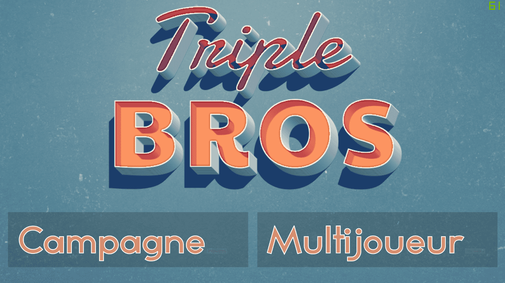
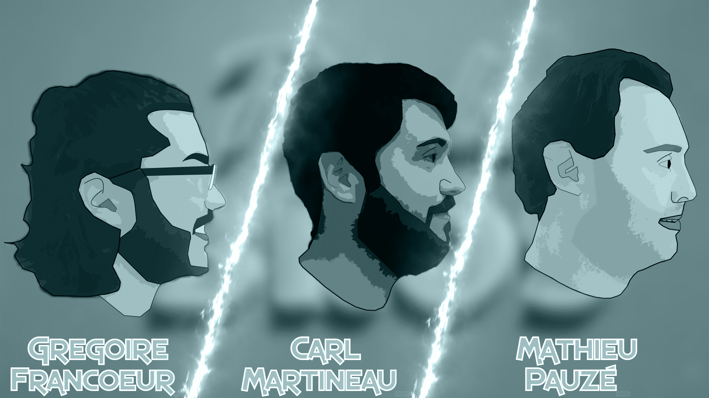
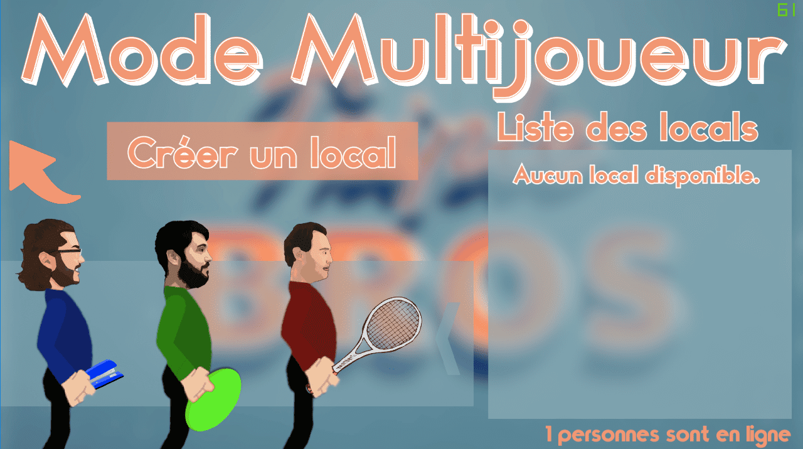
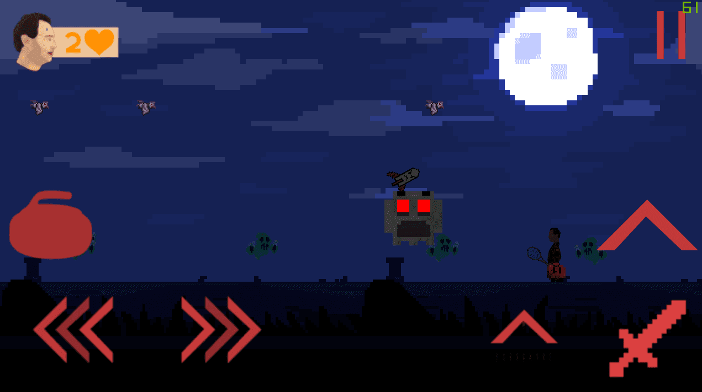
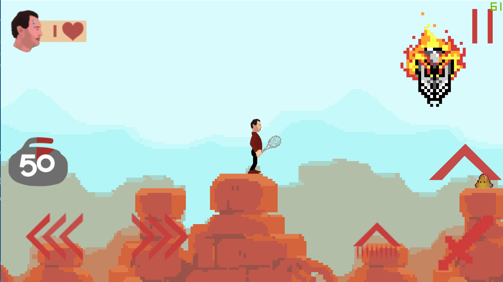
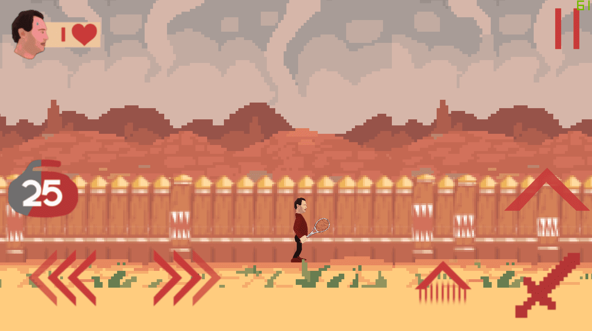

# Triple Bros

A mobile game coded using C# and pushed to the Android's Google Play Store and iOS's App Store. The game has 10 levels that each have 3 difficulty level. There is also a multiplayer battles mode where you can play 1v1 against your friend or 2v2 with a squad. The game was made for the personal project for the IB program in 10th grade, hence the presence of multiple teachers as the characters and the location of the game being at my high school.

#### See the ad for the game [here](https://www.youtube.com/watch?v=YH6xmQUCVZo).

      

Unfortunately the game has been removed from the App Store and Google Play Store due to high maintenance fees, but the game file is still available for free down below. The original source code was also deleted as I did not have enough storage to keep it in my computer back then.

## Download the game file here:

- For iPhone: Download [here](https://www.icloud.com/iclouddrive/0e49hsrCCKYqdADjo9zyDaJ6A#Triple_Bros)
- For Android: Download [apk here](https://www.icloud.com/iclouddrive/0beMAEZ2abMlvQLYAc_60gn1w#Triple_Bros) and [obb here](https://www.icloud.com/iclouddrive/05298ERaM78qVAFADJCHfCkAA#Triple_Bros)
